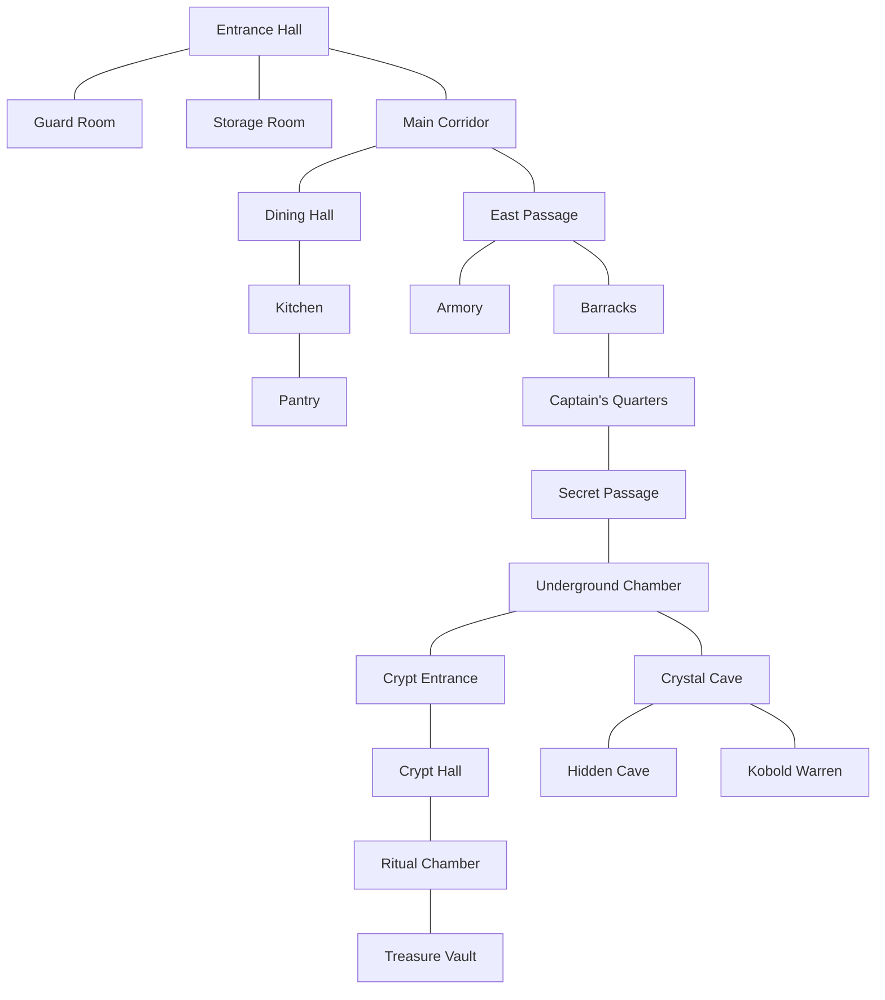

# dnd_world

## Description

`dnd_world` is a detailed dungeon with various interconnected rooms, including an entrance hall, corridors, chambers, and hidden areas.

## Diagram

```mermaid
flowchart TD
    entrance-hall[Entrance Hall]
    guard-room[Guard Room]
    storage-room[Storage Room]
    main-corridor[Main Corridor]
    dining-hall[Dining Hall]
    kitchen[Kitchen]
    pantry[Pantry]
    east-passage[East Passage]
    armory[Armory]
    barracks[Barracks]
    captain-quarters[Captain's Quarters]
    secret-passage[Secret Passage]
    underground-chamber[Underground Chamber]
    crystal-cave[Crystal Cave]
    crypt-entrance[Crypt Entrance]
    crypt-hall[Crypt Hall]
    ritual-chamber[Ritual Chamber]
    treasure-vault[Treasure Vault]
    hidden-cave[Hidden Cave]
    kobold-warren[Kobold Warren]

    %% Connections from entrance-hall
    entrance-hall --- guard-room
    entrance-hall --- storage-room
    entrance-hall --- main-corridor

    %% Connections from main-corridor
    main-corridor --- dining-hall
    main-corridor --- east-passage

    %% Connections from dining-hall and kitchen
    dining-hall --- kitchen
    kitchen --- pantry

    %% Connections from east-passage
    east-passage --- armory
    east-passage --- barracks

    %% Connections from barracks and captain's quarters
    barracks --- captain-quarters
    captain-quarters --- secret-passage

    %% Connection to underground chamber
    secret-passage --- underground-chamber

    %% Connections from underground chamber
    underground-chamber --- crystal-cave
    underground-chamber --- crypt-entrance

    %% Connections from crystal cave
    crystal-cave --- hidden-cave
    crystal-cave --- kobold-warren

    %% Connections from crypt entrance to treasure vault
    crypt-entrance --- crypt-hall
    crypt-hall --- ritual-chamber
    ritual-chamber --- treasure-vault
```
