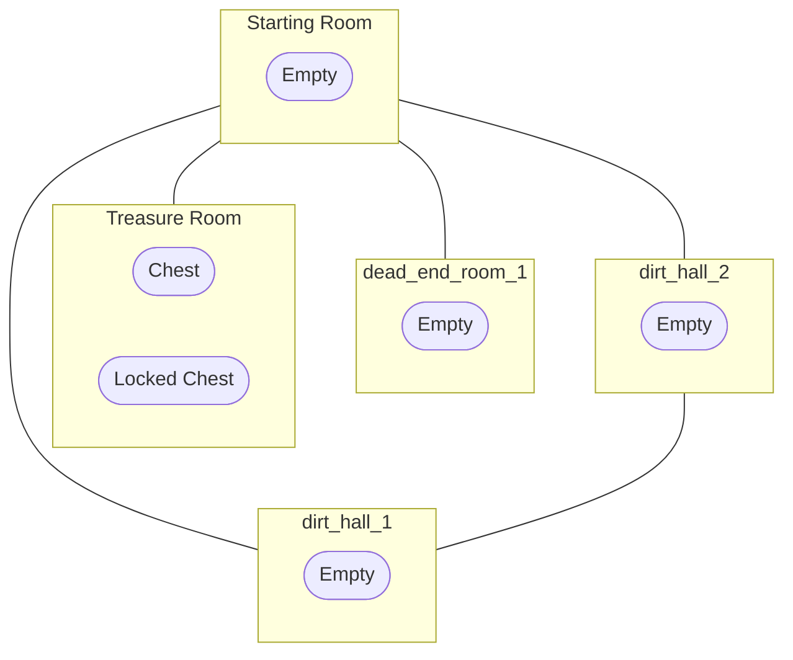

# test_world

## Description

`test_world` is pretty much what it says--a world which can be used to test basic functionality
of the application

## Diagram

```mermaid
flowchart TD
    subgraph starting_room [Starting Room]
        sr_empty([Empty])
    end
    starting_room---dead_end_room_1
    subgraph dead_end_room_1
        der1_empty([Empty])
    end
    starting_room---treasure_room_1
    subgraph treasure_room_1 [Treasure Room]
        tr1_chest([Chest])
        tr1_locked_chest([Locked Chest])
    end
    starting_room---dirt_hall_2
    subgraph dirt_hall_2
        dh2_empty([Empty])
    end
    starting_room---dirt_hall_1
    subgraph dirt_hall_1
        dh1_empty([Empty])
    end
    dirt_hall_2---dirt_hall_1
```