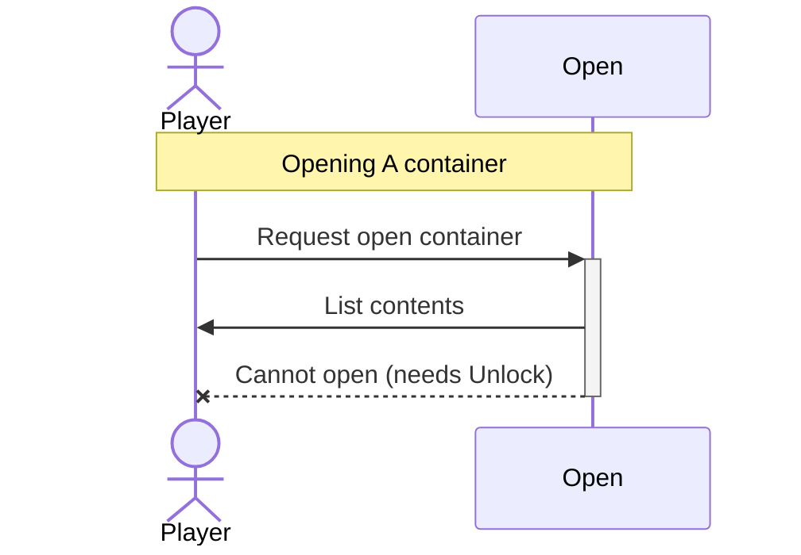
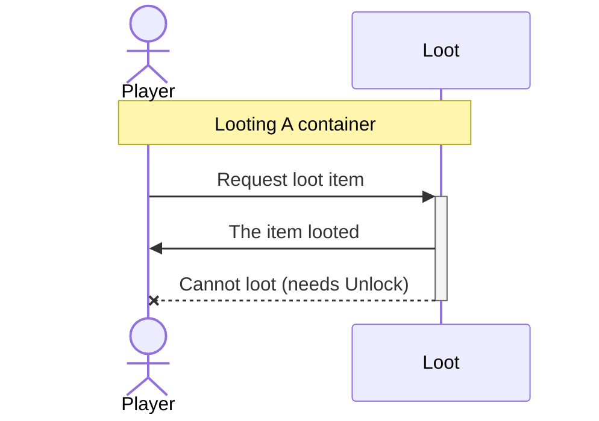
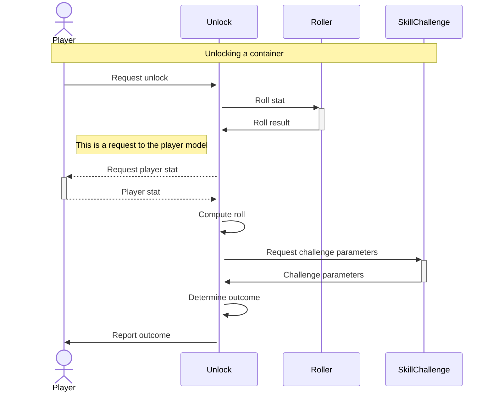

# Interactions

## Container

### Opening

```mermaid
sequenceDiagram
    actor Player
    participant Open
    Note over Player,Open: Opening A container
    Player->>+Open: Request open container
    Open->>Player: List contents
    Open--x-Player: Cannot open (needs Unlock)
```

### Looting

```mermaid
sequenceDiagram
    actor Player
    participant Loot
    Note over Player,Loot: Looting A container
    Player->>+Loot: Request loot item
    Loot->>Player: The item looted
    Loot--x-Player: Cannot loot (needs Unlock)
```

### Unlock

```mermaid
sequenceDiagram
    actor Player
    participant Unlock
    participant Roller
    participant SkillChallenge
    Note over Player,SkillChallenge: Unlocking a container
    Player->>+Unlock: Request unlock
    Unlock->>+Roller: Roll stat
    Roller->>-Unlock: Roll result
    Note right of Player: This is a request to the player model
    Unlock-->>+Player: Request player stat
    Player-->>-Unlock: Player stat
    Unlock->>+Unlock: Compute roll
    Unlock->>+SkillChallenge: Request challenge parameters
    SkillChallenge->>-Unlock: Challenge parameters
    Unlock->>Unlock: Determine outcome
    Unlock->>Player: Report outcome
```