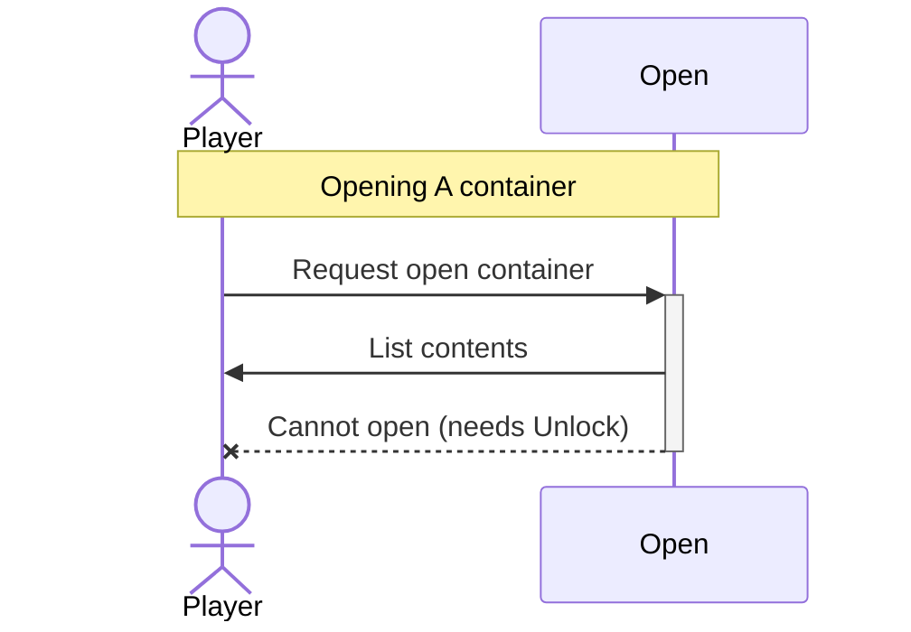
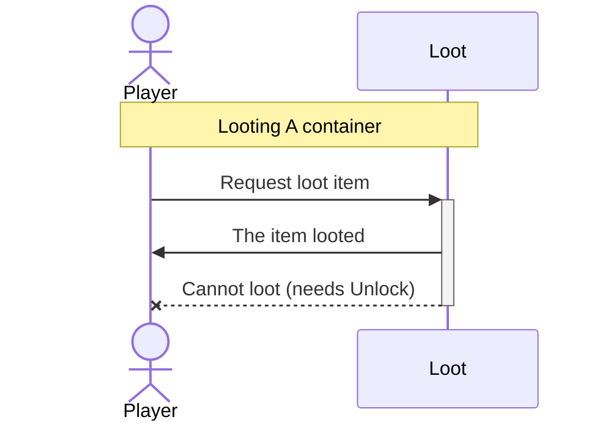
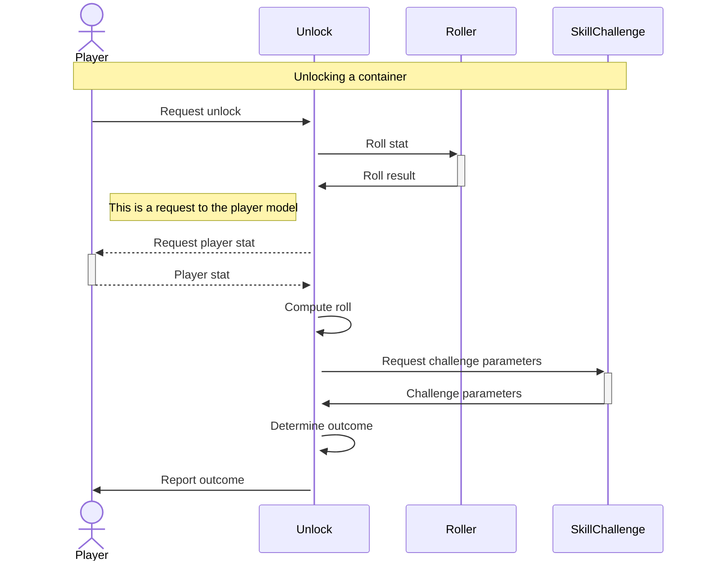
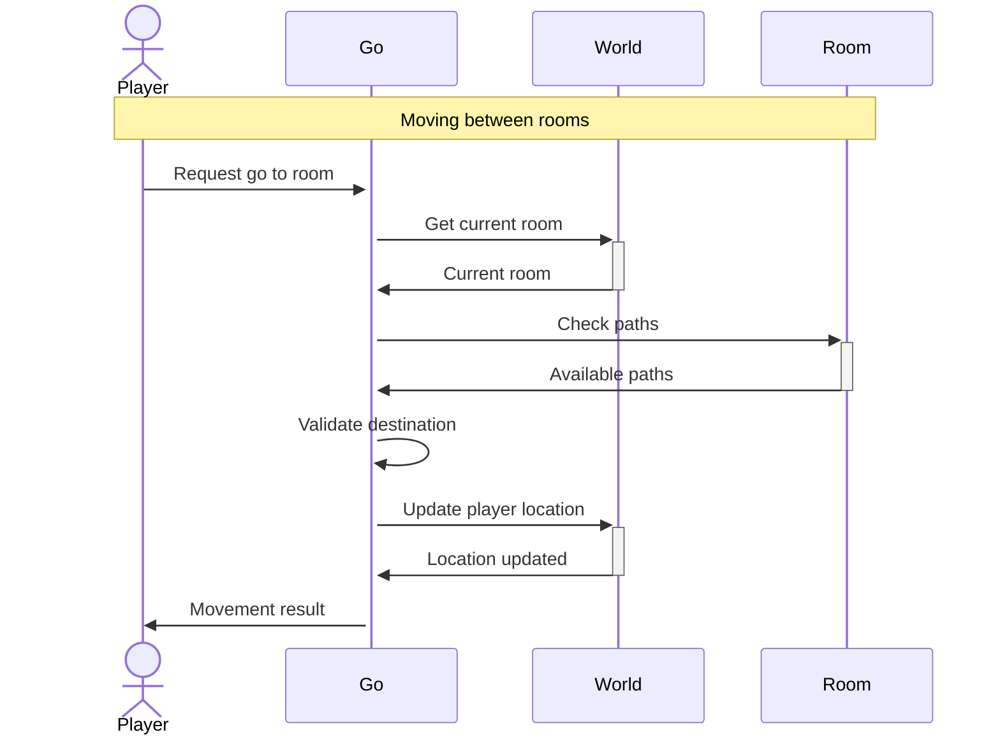
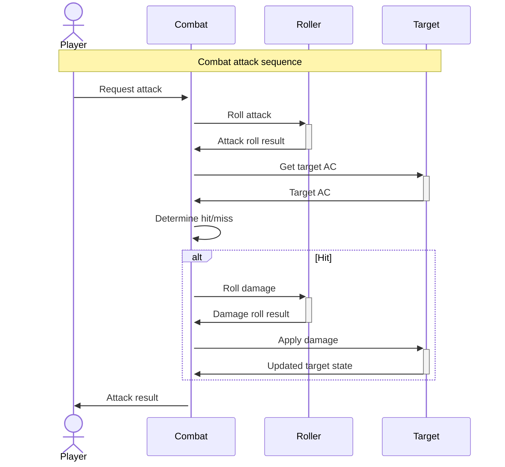
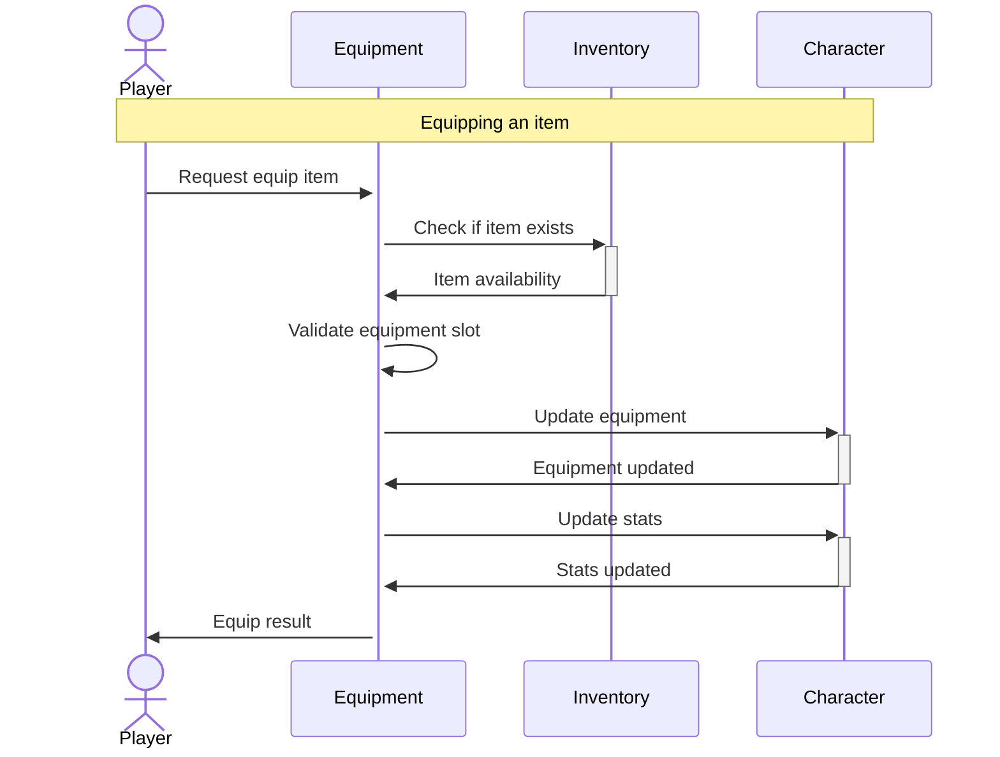

# Interactions

## Container

### Opening

```mermaid
sequenceDiagram
    actor Player
    participant Open
    Note over Player,Open: Opening A container
    Player->>+Open: Request open container
    Open->>Player: List contents
    Open--x-Player: Cannot open (needs Unlock)
```

### Looting

```mermaid
sequenceDiagram
    actor Player
    participant Loot
    Note over Player,Loot: Looting A container
    Player->>+Loot: Request loot item
    Loot->>Player: The item looted
    Loot--x-Player: Cannot loot (needs Unlock)
```

### Unlock

```mermaid
sequenceDiagram
    actor Player
    participant Unlock
    participant Roller
    participant SkillChallenge
    Note over Player,SkillChallenge: Unlocking a container
    Player->>+Unlock: Request unlock
    Unlock->>+Roller: Roll stat
    Roller->>-Unlock: Roll result
    Note right of Player: This is a request to the player model
    Unlock-->>+Player: Request player stat
    Player-->>-Unlock: Player stat
    Unlock->>+Unlock: Compute roll
    Unlock->>+SkillChallenge: Request challenge parameters
    SkillChallenge->>-Unlock: Challenge parameters
    Unlock->>Unlock: Determine outcome
    Unlock->>Player: Report outcome
```

## Navigation

### Room Movement

```mermaid
sequenceDiagram
    actor Player
    participant Go
    participant World
    participant Room
    Note over Player,Room: Moving between rooms
    Player->>+Go: Request go to room
    Go->>+World: Get current room
    World->>-Go: Current room
    Go->>+Room: Check paths
    Room->>-Go: Available paths
    Go->>Go: Validate destination
    Go->>+World: Update player location
    World->>-Go: Location updated
    Go->>Player: Movement result
```

## Combat (Planned)

### Attack Sequence

```mermaid
sequenceDiagram
    actor Player
    participant Combat
    participant Roller
    participant Target
    Note over Player,Target: Combat attack sequence
    Player->>+Combat: Request attack
    Combat->>+Roller: Roll attack
    Roller->>-Combat: Attack roll result
    Combat->>+Target: Get target AC
    Target->>-Combat: Target AC
    Combat->>Combat: Determine hit/miss
    alt Hit
        Combat->>+Roller: Roll damage
        Roller->>-Combat: Damage roll result
        Combat->>+Target: Apply damage
        Target->>-Combat: Updated target state
    end
    Combat->>Player: Attack result
```

## Equipment (Planned)

### Equip Item

```mermaid
sequenceDiagram
    actor Player
    participant Equipment
    participant Inventory
    participant Character
    Note over Player,Character: Equipping an item
    Player->>+Equipment: Request equip item
    Equipment->>+Inventory: Check if item exists
    Inventory->>-Equipment: Item availability
    Equipment->>Equipment: Validate equipment slot
    Equipment->>+Character: Update equipment
    Character->>-Equipment: Equipment updated
    Equipment->>+Character: Update stats
    Character->>-Equipment: Stats updated
    Equipment->>Player: Equip result
```
